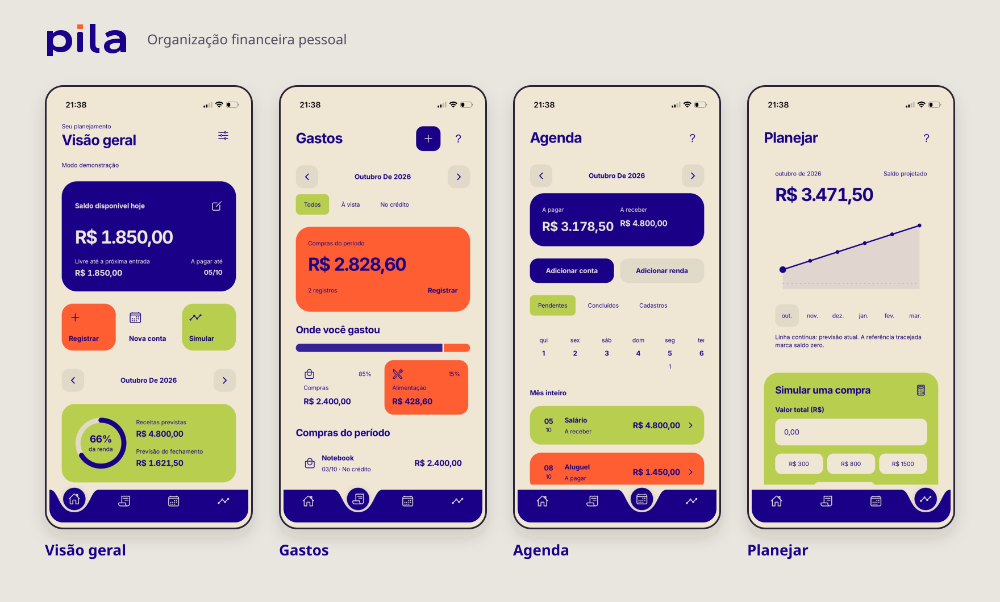
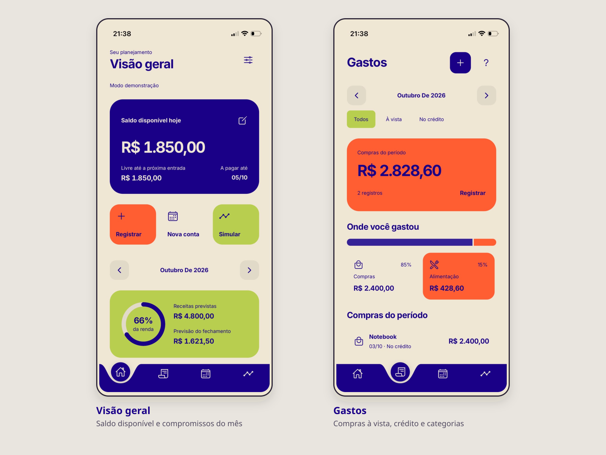
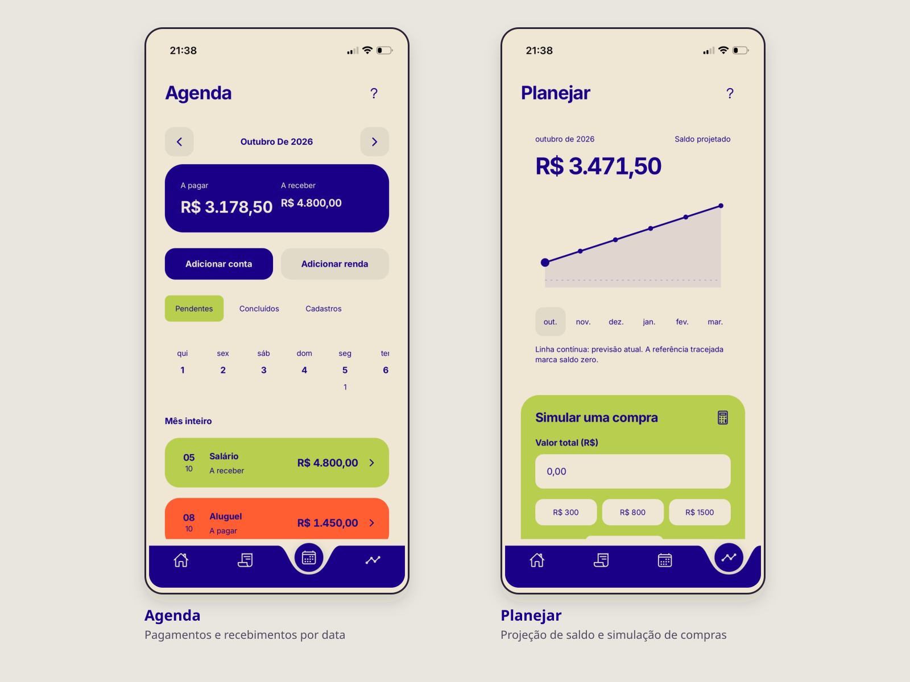

# Pila

**Organização financeira pessoal com foco no que vem pela frente.**

O Pila reúne renda, contas, compras e faturas para ajudar a entender quanto dinheiro está disponível hoje e como as decisões de agora afetam os próximos meses. A pessoa registra seus dados, acompanha os compromissos e pode simular uma compra antes de assumi-la.

**React Native · Expo · TypeScript · Expo Router · AsyncStorage**



> Capturas feitas no iPhone com dados de demonstração. A apresentação usa o mesmo tratamento visual do portfólio: fundo neutro suave, telas completas, molduras arredondadas e sombras discretas.

## Uma rotina, quatro caminhos

| Tela | O que você pode fazer |
| --- | --- |
| **Visão geral** | Acompanhar saldo disponível, comprometimento da renda e próximos pagamentos. |
| **Gastos** | Registrar compras à vista ou no cartão, filtrar categorias e consultar as faturas do mês. |
| **Agenda** | Organizar contas e receitas por data e confirmar pagamentos e recebimentos. |
| **Planejar** | Explorar o saldo dos próximos meses e comparar o impacto de uma compra à vista ou parcelada. |

### Acompanhar e registrar



O início reúne o saldo atual, o valor livre até a próxima entrada e o planejamento do mês. Os atalhos abrem o registro de gastos, o cadastro de contas e a simulação. Em Gastos, tocar em uma categoria filtra os registros e leva à lista correspondente.

### Organizar e decidir



A Agenda separa compromissos pendentes, concluídos e cadastros. O calendário permite filtrar um dia; a confirmação de cada evento atualiza os registros financeiros. Em Planejar, o gráfico permite selecionar meses e comparar a previsão com uma nova compra, sem salvar a simulação como gasto.

**Capturas originais:** [Visão geral](docs/screenshots/iphone/visao-geral.jpeg) · [Gastos](docs/screenshots/iphone/gastos.jpeg) · [Agenda](docs/screenshots/iphone/agenda.jpeg) · [Planejar](docs/screenshots/iphone/planejar.jpeg).

## Funcionalidades

- **Renda e saldo:** salário líquido, dia de recebimento, receitas adicionais e saldo inicial informado.
- **Contas e dívidas:** despesas fixas, pontuais e parceladas, com vencimentos e parcelas restantes.
- **Cartões:** limite, fechamento, vencimento, compras parceladas e total de uma fatura já existente.
- **Gastos por categoria:** registros à vista e no crédito, filtros por período, categoria e cartão.
- **Pagamentos e recebimentos:** confirmação com opção de indicar que o valor já está incluído no saldo informado.
- **Previsão financeira:** projeção de seis meses, reserva mensal planejada e simulação de compras; a comparação pode ser estendida até o fim das parcelas.
- **Dados no aparelho:** armazenamento local e modo de demonstração opcional para conhecer o fluxo antes de cadastrar dados próprios.
- **Preferências:** tema claro, escuro ou do sistema, português/inglês e três tamanhos de leitura.

## Decisões de produto e interface

**Saldo atual e previsão têm papéis diferentes.** O saldo acompanha os movimentos registrados; a previsão considera receitas, contas e parcelas futuras. A interface mantém essa distinção para não apresentar renda ainda não recebida como dinheiro disponível.

**Compras e faturas também têm leituras diferentes.** Gastos mostra o valor integral das compras pela data do registro. A fatura mostra as parcelas devidas naquele mês. Isso permite consultar tanto o consumo quanto o compromisso mensal.

**Os gráficos funcionam como controles.** Categorias filtram registros, dias filtram compromissos e os meses do gráfico alteram a projeção em destaque. Explicações ficam na ajuda, e opções adicionais dos formulários aparecem quando necessárias.

**A navegação tem identidade própria.** Quatro ícones, um botão ativo flutuante e uma curva que o acompanha com animação nativa. A troca de telas usa fade; o movimento do seletor respeita a preferência de movimento reduzido do sistema.

A paleta combina **Eggshell `#EFE7D4`**, **Yellow Green `#B8CE4F`**, **Tiger Flame `#FF5E32`** e **Dark Ultramarine `#1A0088`**. A marca foi desenhada em vetor e aparece na abertura e em Ajustes. Os controles mantêm nomes acessíveis mesmo quando exibem somente ícones, e salvamentos e confirmações oferecem retorno visual e anúncio para leitores de tela.

## Arquitetura

As regras financeiras ficam separadas das telas. O estado compartilhado coordena os registros e a persistência; componentes reutilizáveis concentram formulários, gráficos, navegação e preferências.

```text
mobile/
├── app/                          # Rotas do Expo Router
│   ├── (tabs)/                   # Início, Gastos, Agenda e Planejar
│   ├── ajustes.tsx
│   └── perfil.tsx                # Renda e dados financeiros
├── src/
│   ├── app/                      # Layouts e providers
│   │   └── providers/PilaProvider.tsx
│   ├── domain/Planejamento.ts    # Modelos e cálculos financeiros
│   ├── features/finance/         # Telas e componentes do planejamento
│   └── shared/                   # Tema, preferências, navegação e primitives
└── assets/brand/                  # Marca, ícones e splash

docs/
├── screenshots/iphone/           # Capturas originais
└── images/                       # Composições do README e capa para portfólio
```

| Camada | Responsabilidade | Referência |
| --- | --- | --- |
| Domínio | Distribuição de parcelas, faturas, saldo, agenda e projeções. | [Planejamento.ts](mobile/src/domain/Planejamento.ts) |
| Estado e armazenamento | Operações financeiras, leitura dos dados e gravações locais em sequência. | [PilaProvider.tsx](mobile/src/app/providers/PilaProvider.tsx) |
| Experiência | Registro, calendário, filtros e simulação. | [Finance](mobile/src/features/finance/) |
| Preferências | Tema, idioma e escala de texto, salvos separadamente dos dados financeiros. | [PreferencesProvider.tsx](mobile/src/shared/preferences/PreferencesProvider.tsx) |
| Navegação | Seleção animada, eventos das abas e acessibilidade. | [CurvedTabBar.tsx](mobile/src/shared/components/navigation/CurvedTabBar.tsx) |

### Cuidados nas regras financeiras

- O parcelamento é calculado em centavos. Eventuais diferenças de arredondamento ficam na última parcela, preservando o total da compra.
- Fechamento e vencimento do cartão determinam a primeira fatura; o formulário permite ajustar essa referência.
- Quando há total de fatura informado e compras detalhadas, a referência é o maior desses valores, evitando somar duas vezes o mesmo compromisso.
- Pagamentos e recebimentos passam por confirmação. A opção de valor já incluído no saldo inicial evita um novo desconto ou acréscimo indevido.
- As preferências de aparência são independentes dos dados financeiros. O armazenamento oferece tratamento de falhas de leitura e escrita.

## Executar no celular

**Requisitos:** Node.js 22.13 ou superior, npm e Expo Go compatível com o SDK do projeto.

Versões declaradas: **Expo SDK 57.0.26**, **React 19.2.3** e **React Native 0.86.3**.

```bash
git clone https://github.com/GisellyPereira/pila.git
cd pila
npm install
npm start
```

O comando na raiz instala também as dependências de `mobile/`. O início abre o Expo Go e limita o Metro a **um worker**, reduzindo o consumo do computador.

Escaneie o QR code com o celular na mesma rede Wi-Fi. Se precisar de conexão por túnel:

```bash
npm run start:tunnel
```

Não é necessário configurar uma API ou credenciais para o fluxo financeiro atual. Ao abrir pela primeira vez, informe renda e saldo ou escolha **Explorar um mês preenchido** para conhecer o exemplo.

## Estado atual e limites

Projeto de portfólio em evolução, com capturas reais da interface no iPhone. Os dados são inseridos manualmente e ficam no aparelho, sem sincronização entre dispositivos. Não há integração bancária, pagamento de boletos, cálculo automático de juros ou notificações agendadas.

As projeções dependem dos registros cadastrados e não são uma garantia de saldo futuro. Compras com juros devem ser registradas com seu custo total. O armazenamento utiliza AsyncStorage; não oferece criptografia própria dos registros. O repositório ainda não possui uma suíte de testes automatizados para o fluxo financeiro atual.

## Autoria

Criado por [Giselly Pereira](https://github.com/GisellyPereira), com foco em desenvolvimento mobile, regras de negócio e experiência de uso.
